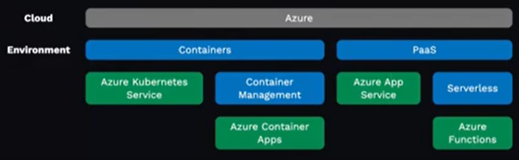
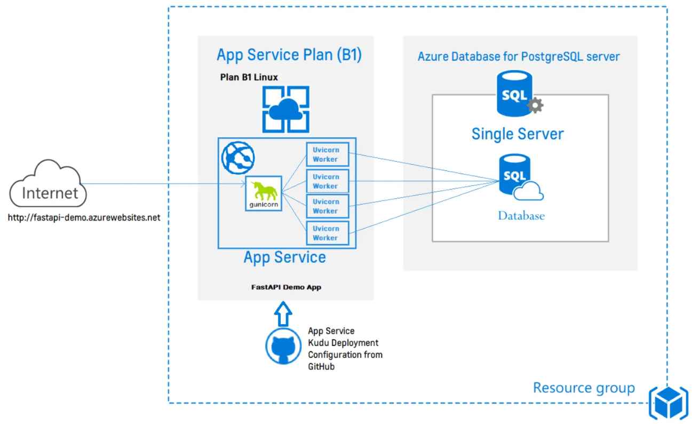

https://diataxis.fr/ - A systematic framework for technical documentation authoring.

GitHub Codespaces is a cloud-based development environment that enables developers to write, build, and debug their code directly from their web browser.

Free APIs to try: Zippopotamus, Sunrise/Sunset, Reddit

pip install urllib3 rich fastapi "uvicorn[standard]"

Processing APIs in python use urllib, requests or urllib3

    PoolManager is a class in the urllib3 library used to manage connection pools for one or more HTTP connections. 
    It is used to create an instance of an HTTP connection pool with a specified number of connections. 
    You can use this instance to send multiple requests to the same host and reuse the same connection for each request, 
    which can result in faster response times and reduced overhead.

    rich is a Python library for rich text and beautiful formatting in the terminal. 
    It provides various features such as syntax highlighting, progress bars, tables, markdown, and more. 
    It aims to make it easier to create beautiful and informative console output. It supports both Python 3.6+ and PyPy3.

FastAPI - https://fastapi.tiangolo.com/
    FastAPI is a web framework for building APIs with Python 3.7+. It is designed to be easy, fast and to provide high performance.

    It uses the Python type hinting system to validate data types and function parameters, which makes it write and maintain type-safe APIs.

    FastAPI is a lightweight ASGI (Asynchronous Server Gateway Interface) framework, compatible with a wide range of ASGI servers such as Uvicorn and Hypercorn, which provide high-performance web servers.

    It contains a built-in OpenAPI and JSON Schema generator, which allows to generate API documentation and client libraries. Additionally, It has built-in support for testing and debugging your API.

    FastAPI is a python framework designed specifically for building HTTP APIs.
        Fast to build and fast to execute
        Relies on python types (via pydnatic)
        Auto-generated documentation (via Swagger-UI)
        Based on the OpenAPI specifications.
        Supports passing parameters in the path, cookies, headers or body.

    Running FastAPI locally
        Put code in api/main.py
        Run the server: uvicorn  api.main:app --reload --port=8000
            api.main:app specifies the module and the variable name of the application that needs to be run.
            --reload enables hot-reloading, any code changes, the server will restart automatically.
            --port=8000, which the server will be listening for incoming requests.
        
        Try the API and docs : http://127.0.0.1:8000/generate_name
                               http://127.0.0.1:8000/docs   
                               http://127.0.0.1:8000/redoc
                               http://127.0.0.1:8000/openapi.json 

Testing FastAPI apps
    Configuring pytest and coverage
        Create a requirements-dev.txt file:
            -r api/requirements.txt
            fastapi[all]
            pytest
            pytest-cov
            coverage

            "-r api/requirements.txt" flag,install the required Python packages listed in the api/requirements.txt file.
            "fastapi[all]" package, installs FastAPI with all dependencies (Uvicorn, Pydantic and other libraries)
            "pytest" package is a testing framework that allows you to write and run automated tests for your Python code.
            "pytest-cov" package is a plugin for pytest that provides code coverage reports for your tests.
            "coverage" package is a tool that measures code coverage during Python program execution.

        Configure inside pyproject.toml
            [tool.pytest.ini_options]
            addopts = "-ra --cov api"
            testpaths = [ "tests" ]
            pythonpath = ['.']    

            pyproject.toml is a configuration file used by modern Python projects that adopt the poetry build tool. It is similar to other configuration files like setup.cfg, setup.py, or requirements.txt, but with additional features and functionalities.
                "[tool.pytest.ini_options]" - contains additional configuration options to pass to pytest, a popular Python testing framework.
                "addopts" - specifies additional command-line options to pass to pytest. 
                    "-ra" tells pytest to output all test results
                    "--cov api" enables test coverage reporting for the api module.
                "testpaths" -specifies directories tests (containing all tests).
                "pythonpath" - specifies which directories to include in the Python module search path. In this case, . (the current directory) is included, so that modules in the current directory can be imported and used in the tests.

    Create folde and file - "tests\test_api.py"        
    pip install -r requirements-dev.txt
    python -m pytest
        - Name          Stmts   Miss  Cover
        ---------------------------------
        api/main.py      19      9    53%
        - not giving missing lines details
    python -m pytest --cov-report=html
        - it will create folder htmlcov
        - go to the folder, run python3 -m http.server 8000 --bind 127.0.0.1
        - browse to see the coverage report https://127.0.0.1/htmlcov/index.html

Property-based tests with schemathesis
    Property-based testing is a type of testing approach that focuses on generating a large number of random inputs to test functions and APIs. Instead of manually creating test, the testing framework generates automatically, based on predefined properties.

    Schemathesis is a Python library for property-based testing of APIs. It automatically generates API test cases based on their OpenAPI schema (Swagger). IT generates a large number of random requests to the API and checking that the responses match the expected schema.

    Schemathesis also has various features like test coverage analysis, response time tracking, and compatibility with different Python testing frameworks like pytest.

    By using schemathesis, developers can perform thorough testing of their APIs with minimal manual effort, which can lead to more reliable and bug-free code. It's useful for ensuring that your API is robust and can handle a variety of inputs and outputs.

    Add schemathesis to requirments-dev.txt
        
    Generaete tests based on the OpenAPI Spec: ("tests\property_based.py")
        import schemathesis
        from api.main import app
        schema = schemathesis.from_asqi("/openapi.json",app)
        
        #schema.parametrize()
        def test_api():
            response = case.call_asqi()
            case.validate_response(response)

    pip install -r requirements-dev.txt

    Run the tests
        pytest -k test_api   
        pytest -v tests/property_based.py 

        Error, when i run pytest -v tests/property_based.py  

            E       schemathesis.exceptions.CheckFailed: 
            E       1. Received a response with a status code, which is not defined in the schema: 404
            E       Declared status codes: 200, 422
            E       Response status: 404
            E       Response payload: `{"detail":"No names available"}`    

        To solve the error either add 
            (property_based.py)
                if response.status_code == 404:
                    assert response.content == b'{"detail":"No names available"}'
                else:
                    case.validate_response(response)
            OR main.py
                @app.get("/generate_name_qs", responses={404:{}})

Through Visual Code, run unit test
    Configure Python Tests -> Select pytest pytest framework -> select "tests" folder -> "Run Tests"

Proudctionizing FastAPI apps
    Gunicorn (Green Unicorn), is a Python Web Server Gateway Interface (WSGI) HTTP server.
        It's used in popular Python web frameworks (Flask, Django, Pyramid, and Bottle). It can handle requests from multiple clients simultaneously by pre-forking worker processes to handle each request, resulting in efficient resource utilization.

        It's easy use and configure (including logging, worker processes, worker class, timeout, and more). It can also be integrated with a wide range of deployment tools, such as Docker, Kubernetes, and Heroku.

    Gunicorn- won't work windows, it will work on unix
        It's a production-level server that can run multiple worker process

        Add gunicorn to requirements.txt
            fastapi==0.95.1
            uvicorn[stanadard]==0.22.0
            gunicorn==20.1.0

        Pip install -r requirements-dev.txt
        Use gunicorn to run FastAPI app using uvicorn worker:
            python -m gunicorn api.main:app --workers 4 --worker-class uvicorn.workers.UvicornWorker --bind 0.0.0.0:8000     

            This command starts a Gunicorn server to run a Python web application located in api/main.py, using the FastAPI app instance app. The server will run with 4 worker processes to handle incoming requests, using the uvicorn worker class UvicornWorker to support asynchronous handling of requests. The server will listen on all available network interfaces (0.0.0.0) on port 8000.
            "python -m gunicorn" invokes the Gunicorn server using the python interpreter.
    
    Configuring gunicorn
        Gunicorn can be configured with a "gunicorn.conf.py" file to adjust worker count based on CPU cores

            # Gunicorn configuration file
            # https://docs.gunicorn.org/en/stable/configure.html#configuration-file
            # https://docs.gunicorn.org/en/stable/settings.html

            import multiprocessing

            max_requests = 1000
            max_requests_jitter = 50
            log_file = "-"
            bind = "0.0.0.0:3100"
            worker_class = "uvicorn.workers.UvicornWorker"
            workers = (multiprocessing.cpu_count() * 2) + 1

        In this particular example, we see the following configurations:
            max_requests: sets the maximum number of requests a worker will process before restarting
            max_requests_jitter: sets the maximum jitter to add to the max_requests value to reduce the likelihood of all workers restarting at the same time
            log_file: sets the location for the Gunicorn server logs, in this case, logs will be sent to standard output (-)
            bind: sets the address and port on which Gunicorn will listen for connections
            worker_class: sets the worker class for handling requests, in this case, it's using UvicornWorker, a worker for the Uvicorn ASGI server
            workers: sets the number of worker processes for handling incoming requests. The number of workers is calculated based on the number of available CPUs, adding 1 and then multiplying by 2.

        Run command can be simplified to
            cd api
            python -m gunicorn main:app

Hosting an HTTP API on Azure!
    Hosting considerations
        How much traffic do you expect?
        How variable will the traffic be?
        Do you need scale-to-zero?
        What's your budget?
        Is it public facing?
        How will you manage API use?
    
    Azure hosting options
   
    
    Ways to deploy to Azure App Service
        VS Code extension
        Azure Portal (with Github integration)
        Azure CLI
        Azure Developer CLI with Bicep

    Deployig to App Service with VS Code
        VS code extension -> Search "Azure Tools" -> Install  "Azure Tools"
        Select "Create resource" > "Create App Service Web App"
            Enter a name
            Select runtime stack (Pythong 3.11)
            Select tier (Free - F1)
        Select "Deploy" and select "api" as the path to deploy.   

    https://github.com/microsoft/Oryx
        Oryx is a build tool developed by MS that is designed to simplify the process of building and deploying web applications to Azure App Service. Oryx supports a variety of programming languages and platforms, including .NET, Node.js, Python, PHP, and Java.

        When you deploy your application to Azure App Service using Oryx, here is what happens:
            Oryx scans your application's source code to detect the programming language and platform used by your application. It uses this information to select the appropriate buildpack for your application.
            
            The buildpack contains the tools and scripts needed to build and package your application for deployment. Oryx uses the selected buildpack to create a runtime environment for your application.

            Oryx compiles and packages your application according to the requirements of the buildpack. This may involve running commands such as npm install to install dependencies, compiling source code into binaries, or creating an executable JAR file.

            Once the application has been compiled and packaged, Oryx creates a Docker image that contains your application and its runtime environment. This Docker image is then deployed to Azure App Service.
            
            Throughout the deployment process, Oryx performs various optimizations to ensure that project is deployed efficiently and effectively. For example, Oryx uses caching to speed up subsequent builds and deploys, and can automatically detect changes in your project's source code and dependencies to trigger new builds.

            Overall, using Oryx to deploy your project to Azure App Service simplifies the deployment process and ensures that your project is running in a consistent environment optimized for its specific requirements.      

    When you deploy a Python project to Azure App Service using Oryx, the following happens:
        Oryx detects and selects the appropriate buildpack for your project.

        Oryx installs the required Python runtime and dependencies based on the requirements.txt. It may also run other setup tasks such as creating a virtual environment for your project.

        Oryx builds your Python project and packages it as a wheel (.whl) or egg file, which can be installed in another environment. If your project includes static files or other assets, Oryx also collects these files and prepares them for deployment.

        Oryx creates a Docker image that contains your Python project, its dependencies, and any assets or static files. This Docker image is then deployed to Azure App Service.

        Once the Docker image is deployed, Azure App Service starts a container based on the image and your Python project is up and running.
        
    When you deploy to app service, MS tool oryx builds a Docerr image, it also does try to auto start an app if it's Django or flask but it doesn't understand fast API, we will tell it how to start a fast API app.
        Customizing App Service for FastAPI
            App Service doesn't yet know how to automatically run FastAPI apps, so we must tell it.
            Either use the portal
                Select "Settings" > "Configuration" in left nav, then select "General settings" tab.
                In "Startup Command" field, enter
                    python3 -m uvicorn main:app --host 0.0.0.0
                        python3 -m gunicorn main:app (it's not working)
                Save and wait for server to restart.
            Or use the Azure CLI
                az webapp config set --resource-group <resource-group> --name <app-name> --startup-file "python -m gunicorn main:app"    

    ERROR: If you see error  ":( Application Error ..", 
        Tried to  change the service plan to B2, plan Free F1 or Basic B1 won't work - Still Error
        Then change the command to "python3 -m uvicorn main:app --host 0.0.0.0" - it works 

More API Examples
    FastAPI + API Management
        Azure API Management provides features of a public API: subscription keys, rate limiting, IP blocking, etc.
        https://github.com/pamelafox/fastapi-azure-function-apim

    FastAPI + CDN
        Azure CDN provides a global netowrk of servers to cache your API responses.
        https://github.com/pamelafox/staticmaps-function

    FastAPI + scikitleran
        A parameterized API based on a sklearn model.
        https://github.com/pamelafox/scikitlearn-model-to-fastapi-app

Cloud Database for Web Apps  with Django
    Databases
        Types of databases
            Non-relational / document databases: MongoDB, Firebase, CouchDB, etc.
            Relational databases: MySQL, SQLite, PostgreSQL, etc.
            PostgreSQL: Popular open-source relational database that has a strong community and extension ecosystem. 
                        It's free and can be installed on your computer. It's also available as a service on Azure.
    Databases in Python
    Databases on Azure
    Django
    Django apps on Azure

Dockerfile
    ARG IMAGE=bullseye
    FROM mcr.microsoft.com/devcontainers/${IMAGE}

    ENV PYTHONUNBUFFERED 1

    RUN apt-get update && export DEBIAN_FRONTEND=noninteractive \
        && apt-get -y install --no-install-recommends postgresql-client \
        && apt-get clean -y && rm -rf /var/lib/apt/lists/*
    
    The bullseye Docker image from the MS Container Registry for development containers (mcr.../devcontainers/${IMAGE}). The bullseye image is based on Debian 11, which is a popular Linux distribution.

    The PYTHONUNBUFFERED environment variable is set to 1. This ensures that Python output is unbuffered and sent directly to the console, which can be helpful when debugging applications.

    The RUN command installs the postgresql-client package using apt-get. This package provides the psql command-line tool, which can be used to interact with PostgreSQL databases. The export DEBIAN_FRONTEND=noninteractive command is used to prevent prompts from appearing during the installation process.

    The && apt-get clean -y && rm -rf /var/lib/apt/lists/* command is used to clean up the package cache and remove unnecessary files to reduce the size of the Docker image.

    The provided YAML file is used to configure a Docker Compose environment for a PostgreSQL database. Here is an overview of what the YAML file contains:

docker-compose.yaml
    services:
        app:
            build:
                context: ..
                dockerfile: .devcontainer/Dockerfile
                args:
                    IMAGE: python:3.11
                volumes:
                    - ..:/workspace:cached
                # Overrides default command so things don't shut down after the process ends.
                command: sleep infinity
                # Runs app on the same network as the database container, allows "forwardPorts" in devcontainer.json function.
                network_mode: service:db
       db:
            image: postgres:latest
            restart: unless-stopped
            volumes:
                - postgres-data:/var/lib/postgresql/data
            environment:
                POSTGRES_DB: postgres
                POSTGRES_USER: admin
                POSTGRES_PASSWORD: LocalPasswordOnly

            # Add "forwardPorts": ["5432"] to **devcontainer.json** to forward PostgreSQL locally.
            # (Adding the "ports" property to this file will not forward from a Codespace.)
    volumes:
        postgres-data:

    This defines two services - app and db.

        The app service builds the Docker image from the dockerfile using the Python version. The volumes section mounts the parent directory (..) of the .devcontainer directory to the /workspace directory in the container, allowing the local code changes to be reflected in the container. The command section keeps the container running indefinitely, and network_mode section sets the network mode to be the same as the db service, allowing them to communicate with each other.

        The db service uses the latest PostgreSQL image from Docker Hub, and volumes section mounts the postgres-data volume to the /var/lib/postgresql/data directory in the container. The environment section sets the POSTGRES_DB, POSTGRES_USER, and POSTGRES_PASSWORD environment variables, which are used to create a new PostgreSQL database and user.

        This defines a named volume called postgres-data, which can be used to persist data across container restarts. Any data that is stored in the /var/lib/postgresql/data directory in the db service will be persisted in this volume.

devcontainer.json is a configuration file used by Visual Studio Code to define a development container for a project. It specifies the development environment, including the Docker image to use, the container configuration, and the extensions to install in the container.

devcontainer.json: Top level config
    Configuration needed to work with the Docker files:
        "name": "python-db-copilot",  => Sets the name of the development container to python-db-copilot.
        "dockerComposeFile": "docker-compose.yaml", => Specifies the Docker Compose file to use when building the dev container.
        "service": "app", => Specifies which service in the Docker Compose file to use as the main dev environment.
        "workspaceFolder": "/workspace", => Specifies the workspace folder in the container that will be mapped to the local 
                                            project directory.
        "forwardPorts": [5432], => Specifies which ports to forward from the container to the local machine. 
                                   In this case, it forwards port 5432, which is the default port for PostgreSQL.
        "portsAttributes": {
            "5432": {"label": "PostgreSQL port", "onAutoForward": "silent"}
        }, => Provides additional attributes for the forwarded port. In this case, a label to identify the forwarded port and
              sets the onAutoForward attribute to "silent", which means that VSC Code will automatically forward the port without prompting the user.

    Installing extensions:
        "ms-python.python", => Official Python extension for VSC, it provides features such as linting, debugging, 
                                code completion for Python.
        "ms-python.vscode-pylance", => An optional language server for Python that provides more advanced type 
                                    checking and autocomplete features.
        "charliermarsh.ruff", => This extension provides support for the Ruff database migration tool.
        "ms-python.black-formatter", =>  This extension provides support for the Black code formatter for Python.
        "mtxr.sqltools", => General-purpose SQL extension that provides features(syntax highlighting, code completion, and database management.)
        "mtxr.sqltools-driver-pg", => This is a PostgreSQL driver for the SQL Tools extension.
        "ms-vscode.vscode-node-azure-pack" => Provides support for developing and deploying Node.js applications to Azure.
    
    Configuring SQLTools extension:
        "sqltools.connections": [
            {
                "name": "Local database",
                "driver": "PostgreSQL",
                "server": "localhost",
                "port": 5432,
                "database": "postgres",
                "username": "admin",
                "password": "LocalPasswordOnly"
            },
            {